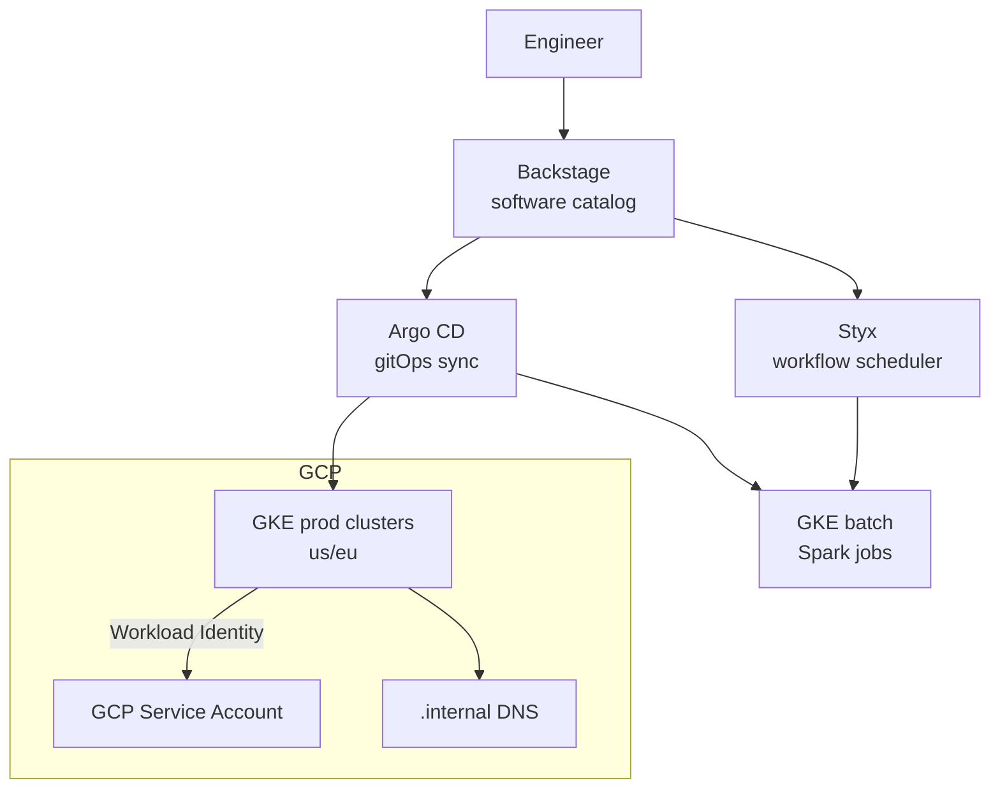

# Spotify — From Borg-Adjacent to Kubernetes with Backstage

> **Category:** Case Study / Tech

| Field | Detail |
|-------|--------|
| **Industry** | Music Streaming / SaaS |
| **Region** | Global |
| **Adoption** | 2020–2021 (GKE primary, some EKS) |
| **Scale** | 500+ microservices · 50+ clusters · 6,000+ devs via Backstage |

## Who & Why K8s

Spotify famously skipped the "build it yourself" years most big tech endured — they ran **Helios / Styx / Luigi** (home-grown schedulers) for years. By 2020 their pain was clear: **operator burden on Helios**, difficulty attracting talent to a non-standard platform, and the need to unify **data infra (Spark on GCP) with application infra** under one API. Kubernetes on **GKE** was chosen as the converged control plane, and **Backstage** (open-sourced 2020) became their internal developer portal *on top of* it.

## Journey

1. **2020**: Greenfield decision — new services target GKE by default; Helios services stay unless they migrate.
2. **2020–21**: "Kubernetes as the control plane" for both batch (Styx → Argo Workflows) and serving (Helios → GKE).
3. **2021**: Backstage open-sourced and adopted internally as the **single surface** for *creating* a K8s resource (you don't touch YAML; you click in Backstage and it writes the Argo CD Application / K8s manifest for you).

## Architecture

- **Clusters**: regional GKE clusters per environment (prod, staging, test) + dedicated GKE clusters for Spark/Hadoop batch.
- **Identity**: **Workload Identity** binds each K8s ServiceAccount to a GCP ServiceAccount — Pods fetch GCP tokens (BigQuery, GCS) with no keys.
- **CD**: **Argo CD** reconciles per-service `Application` CRs that Backstage scaffolds. The source-of-truth is the developer's chosen repo.
- **Catalog**: Backstage's `catalog` is the *inventory* of which service runs where — it stores the K8s namespace + Argo CD app name for each.

## Tooling

- **Backstage** is the hero: the "create a component" wizard emits a repo with a Helm chart + Argo CD Application template. Developers never hand-write manifests for new services.
- **Argo CD** for GitOps (replacing their own Spinnaker-like tool).
- **Prometheus + Grafana** (GCP's managed Cloud Monitoring + their own Prometheus via the GKE integration) for SLOs.
- **Styx** remains the **batch workflow scheduler** (runs Spark/Presto), with workers on GKE.

## Key Decisions

- **GKE over EKS** — most compute/data is already on GCP (BigQuery, GCS for the data lake); GKE's native integration with GCP storage + Workload Identity was the deciding factor.
- **One Argo CD per environment** (prod/staging/test), **one service catalog per cluster** — keeps the blast radius small and matches Backstage's "component per cluster" model.
- **Backstage as the *only* path to create resources** — kills YAML sprawl and enforces the golden path. Trade-off: devs must go through the portal (no raw kubectl to prod by default).
- **Gradual migration, not cut-over**: Helios services still run; K8s takes new + migrated.

## Results

- Engineers now provision and own a service end-to-end via Backstage **without writing a single K8s manifest**.
- Batch and serving infra converge on one control plane (GKE).
- Onboarding a new microservice went from "email infra team" to "click in Backstage" — a measurable reduction in lead time.

## Interview Angle

> "We didn't migrate Helios. We made Kubernetes the API surface and Backstage the UI. New services live on GKE; the old ones migrate when they're ready. The goal was platform convergence *without* a big bang."

## Related Resources
- [Companies Using Kubernetes](../companies-using-kubernetes.md)
- [GitOps](../15-advanced-patterns/gitops.md)
- [GKE](../09-cloud-integrations/gke.md)
- [Backstage developer portal](https://backstage.io/) (external)
