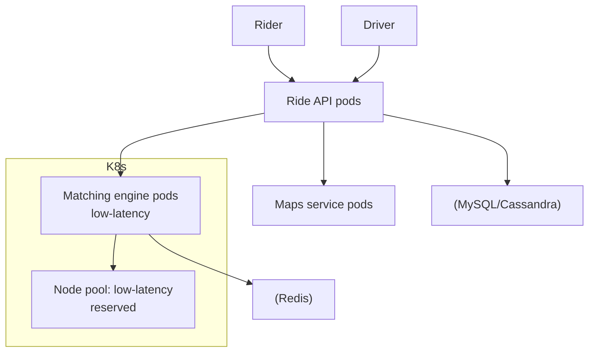

# Uber — Ride-Platform on Kubernetes

> **Category:** Case Study / Mobility / Ride-Hailing

| Field | Detail |
|-------|--------|
| **Industry** | Mobility / Ride-Hailing |
| **Region** | US (multi-cloud) |
| **Adoption** | 2020 (Kubernetes) |
| **Scale** | 400+ services · 12B+ rides |

## Who & Why K8s

Uber runs its ride-platform (matching riders/drivers, maps, payments) on **Kubernetes** across multiple clouds. The driver was breaking their monolith into microservices that could **scale independently** for demand spikes (rush hour, concerts, New Year's Eve) while keeping tight latency budgets for the matching engine.

## Journey

1. Pre-2020: monolithic services on bare metal + OpenStack.
2. 2020: began moving to Kubernetes for new/migrated services.
3. Present: 400+ services; matching/dispatch on low-latency node pools.

## Architecture

- Clusters: per-region across clouds; matching engine on **dedicated low-latency node pools**.
- Latency: dispatch/matching pods co-located (affinity) near Redis cache.
- Storage: Cassandra for time-series trip data; MySQL for user/accounts.

## Tooling

- uKubernetes (Uber's internal platform) on top of Kubernetes.
- Michelangelo (their ML platform) runs training on K8s.
- Prometheus + M3 (their TSDB) for metrics; SLOs on dispatch latency.

## Key Decisions

- Dedicated low-latency node pools for matching — reserved instances, tight affinity to cache.
- Microservices per domain (matching, maps, payments) — each scales to demand independently.
- Multi-cloud footprint to balance cost vs. regional capacity.

## Interview Angle

Uber's infra team said the KPI for the migration was dispatch p99 latency during New Year's Eve: Kubernetes node-pool isolation + Redis co-location kept matching under 100ms even when ride volume peaked at 30x normal — the spike that used to require over-provisioned bare metal.

## Related Resources
- [Companies Using Kubernetes](../companies-using-kubernetes.md)
- [GitOps](../15-advanced-patterns/gitops.md)
- [Scheduling](../07-scheduling-autoscaling/README.md)
