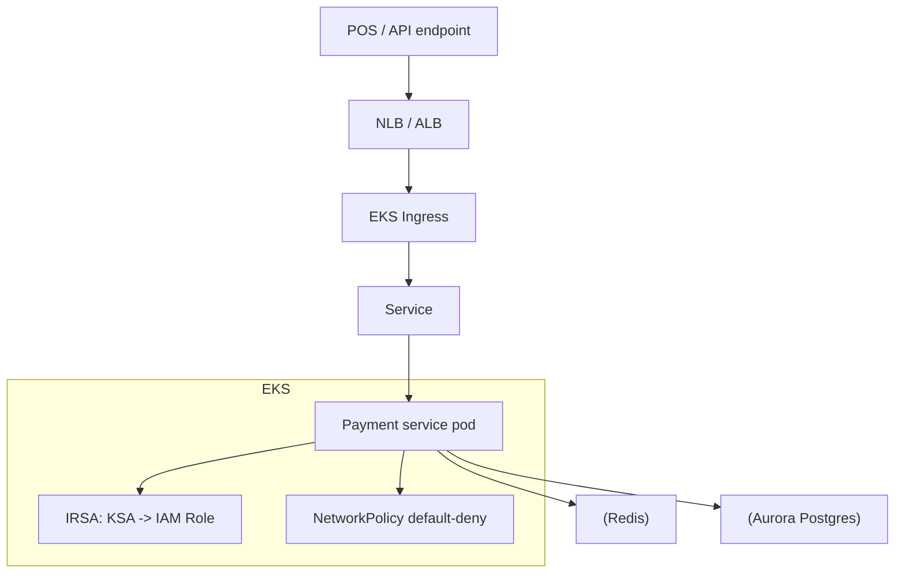

# Visa — Payment Processing on Kubernetes (EKS)

> **Category:** Case Study / Financial Services

| Field | Detail |
|-------|--------|
| **Industry** | Payments / Finance |
| **Region** | Global (AWS) |
| **Adoption** | 2022 (EKS) |
| **Scale** | 100+ services ~ 150 billion transactions/year |

## Who & Why K8s

Visa adopted Kubernetes (EKS) to modernize its payment-processing stack into containerized microservices, aiming for faster feature delivery while handling ~150 billion transactions/year with strict PCI-DSS compliance. K8s gave Visa a uniform, autoscaling surface across regions; EKS let them reuse AWS IAM and their private networking for PCI isolation.

## Journey

1. 2020-21: pilot containerized payment microservices on EKS.
2. 2022: scaled to 100+ services across regions under a common platform.
3. Present: adding services steadily; PCI controls enforced by default.

## Architecture

- Clusters: per-region EKS (prod, staging) with strict namespaces and default-deny NetworkPolicy.
- Identity: IRSA binds service accounts to IAM roles (no AWS keys in pods).
- Security: default-deny NetworkPolicy, signed images enforced at admission, pods non-root.

## Tooling

- Spinnaker + Argo CD for GitOps of payment services.
- Prometheus + Datadog for PCI audit dashboards.
- Vault + KMS for runtime secrets.
- Kyverno/Gatekeeper for policy as code (deny non-signed images, deny privileged).

## Key Decisions

- EKS (not GKE) — Visa's cloud spend and IAM story are AWS-native; EKS keeps PCI on AWS.
- IRSA everywhere — "no keys in code" is a PCI requirement; IRSA made every AWS call attributable.
- Default-deny NetworkPolicy + signed images — a must for 150B annual transactions.

## Interview Angle

The whole Visa platform team repeated a simple principle: every container must carry an identity (IRSA), every transaction path must be a signed image, and every namespace must be isolated. That is why they picked EKS over raw ECS - the platform lets the compliance story ride the same API as the app.

## Related Resources
- [Companies Using Kubernetes](../companies-using-kubernetes.md)
- [EKS](../09-cloud-integrations/eks.md)
- [Security](../06-security/README.md)
- [GitOps](../15-advanced-patterns/gitops.md)
