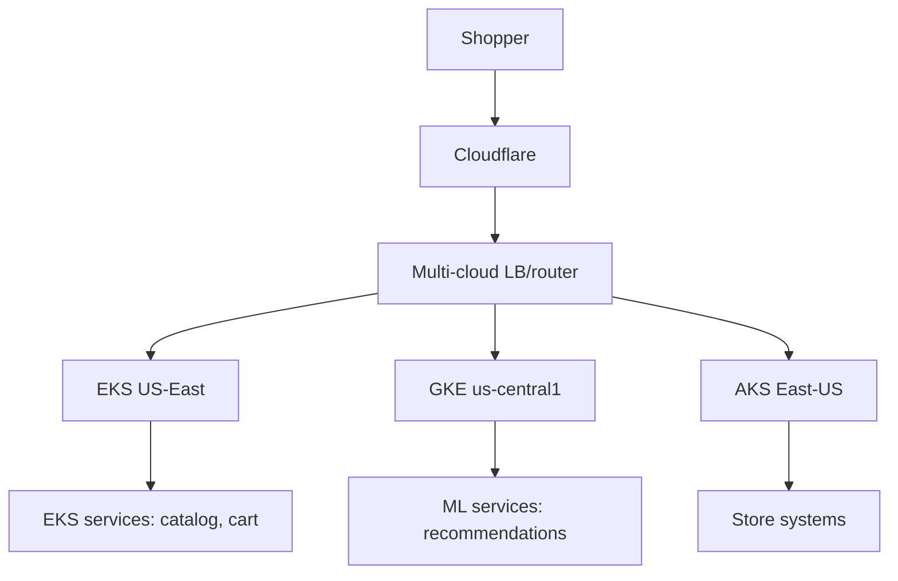

# Walmart — Retail Platform on Kubernetes

> **Category:** Case Study / Retail

| Field | Detail |
|-------|--------|
| **Industry** | Retail / Grocery |
| **Region** | US (multi-cloud) |
| **Adoption** | 2020 (Kubernetes, multi-cloud) |
| **Scale** | 500+ services ~ 2.3M+ weekly shoppers |

## Who & Why K8s

Walmart runs walmart.com, the mobile app, and store systems on Kubernetes across **multiple clouds** (AWS, GCP, Azure) and on-prem. The move (around 2020) was about **portability + cost**: they could place each microservice on the cheapest cloud with the right footprint and avoid vendor lock-in while handling Thanksgiving-day spikes.

## Journey

1. 2019-20: migrated walmart.com and core services to Kubernetes.
2. Adopted a multi-cloud K8s strategy to avoid lock-in and optimize cost.
3. Present: 500+ services across AWS/GCP/Azure + on-prem; unified platform team.

## Architecture

- Multi-cloud: services placed on the cheapest viable cloud; catalog/cart on EKS, ML on GKE.
- Identity: cloud-native workload identity (IRSA on AWS, Workload Identity on GCP, AAD on Azure).
- On-prem: store systems run on a private K8s cluster connected via VPN.

## Tooling

- Internal platform (Walmart Platform Delivery Team) abstracts multi-cloud K8s.
- Prometheus + Grafana + their own telemetry stack.
- Sealed Secrets + cloud KMS for secrets.

## Key Decisions

- Multi-cloud K8s — portability + cost optimization across Black Friday peaks.
- Per-cloud workload identity — each Pod assumes the right cloud IAM role without keys.
- Unified platform tooling — hide multi-cloud complexity from service teams.

## Interview Angle

Walmart's platform lead said the K8s move paid off on Thanksgiving 2022: the same autoscaling rules that ran on AWS handled the overflow on GCP that year, with zero service rewrites — just a different cluster target.

## Related Resources
- [Companies Using Kubernetes](../companies-using-kubernetes.md)
- [EKS](../09-cloud-integrations/eks.md) · [GKE](../09-cloud-integrations/gke.md)
- [GitOps](../15-advanced-patterns/gitops.md)
