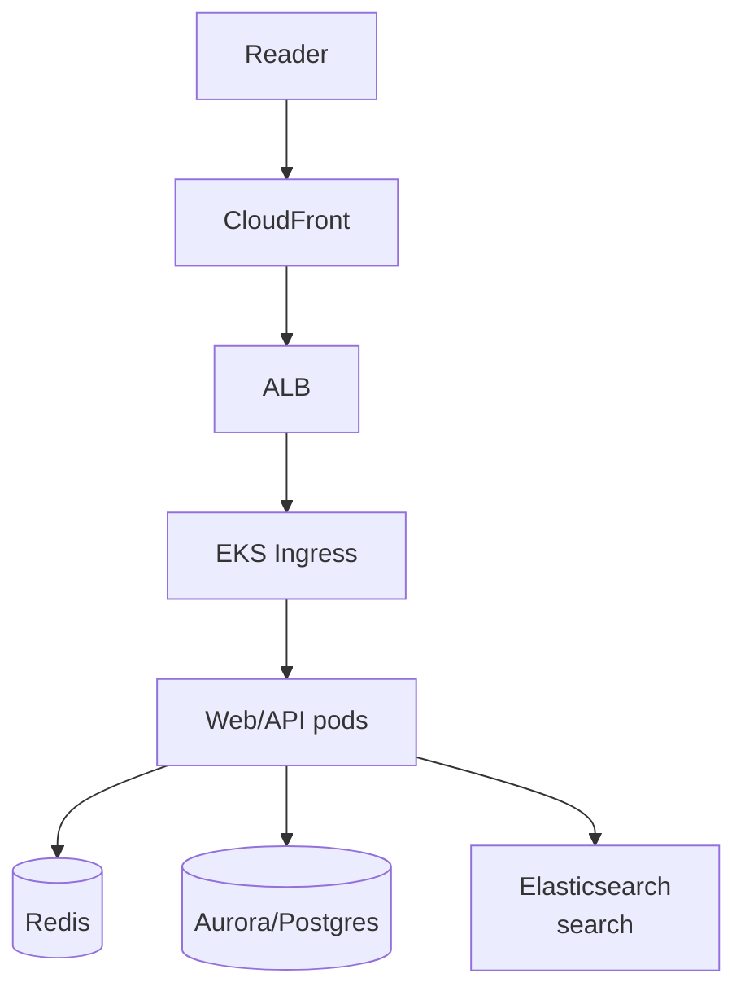

# The Washington Post — News Platform on Kubernetes

> **Category:** Case Study / Media

| Field | Detail |
|-------|--------|
| **Industry** | News / Publishing |
| **Region** | US (AWS) |
| **Adoption** | 2019 (EKS) |
| **Scale** | 100+ services ~ 100 million monthly readers |

## Who & Why K8s

The Washington Post runs its digital news platform (washingtonpost.com) on **EKS** after a multi-year cloud transformation led by their in-house engineering (founded by Jeff Bezos's team). K8s was adopted to modernize publishing, serve breaking-news spikes (elections, emergencies) with autoscaling, and run their **Arc XP** content platform. EKS fit the existing AWS footprint.

## Journey

1. Pre-2019: on-prem data center + early AWS VMs.
2. 2019: moved the core publishing platform to EKS.
3. Present: 100+ microservices; Arc XP SaaS also runs on EKS for customers.

## Architecture

- Clusters: EKS per environment; prod is multi-AZ.
- Caching: Redis for session + breaking-news caching (huge for spike handling).
- Search: Elasticsearch (self-managed on EKS) for site search.

## Tooling

- Spinnaker + internal CI for CD.
- Prometheus + Datadog + their own Arc metrics.
- S3 + CloudFront for media; Aurora for content.

## Key Decisions

- EKS over GKE — AWS-native and the team had AWS expertise from early cloud days.
- Redis for breaking-news cache — elections spike 100x; cache absorbs it.
- Self-managed Elasticsearch on EKS — cheaper than managed at their ingest volume.

## Interview Angle

WaPo engineering said the 2020 election night was the proof: EKS cluster autoscaling + Redis caching let washingtonpost.com handle 10x normal traffic with no downtime, while editorial teams published live updates every minute — something the old data center could never have absorbed.

## Related Resources
- [Companies Using Kubernetes](../companies-using-kubernetes.md)
- [EKS](../09-cloud-integrations/eks.md)
- [GitOps](../15-advanced-patterns/gitops.md)
