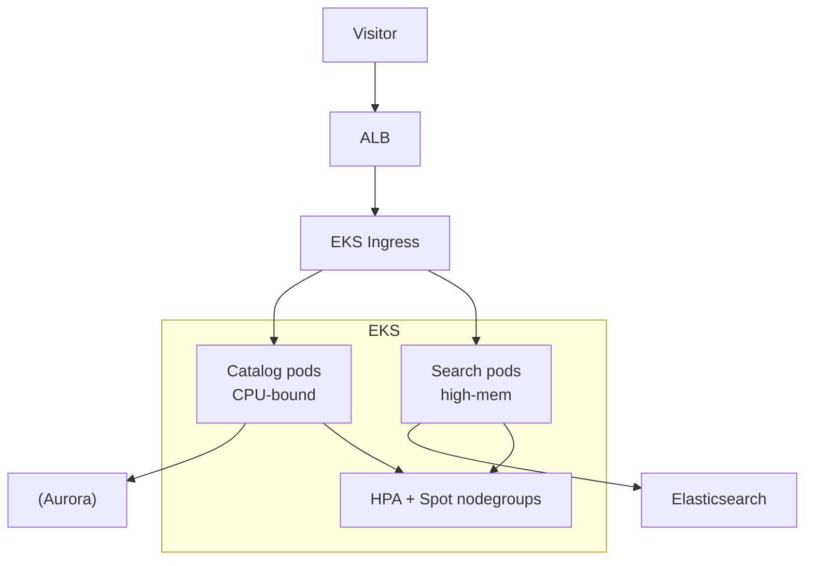

# Wayfair — Home Goods Retail on Kubernetes

> **Category:** Case Study / E-commerce

| Field | Detail |
|-------|--------|
| **Industry** | Furniture / E-commerce |
| **Region** | US (AWS) |
| **Adoption** | 2021 (EKS) |
| **Scale** | 200+ services ~ 35M+ visitors/year |

## Who & Why K8s

Wayfair migrated its e-commerce platform to **EKS** to escape a sprawling fleet of EC2 instances and gain per-service autoscaling for seasonal home-furnishing spikes (Black Friday, spring cleaning). Kubernetes let them containerize the monolith and scale catalog/search services independently.

## Journey

1. 2020: began containerizing catalog/search services.
2. 2021: migrated to EKS; built internal platform tooling on top.
3. Present: 200+ services; heavy use of Spot for catalog indexing.

## Architecture

- Clusters: EKS per environment; search on high-memory nodes, catalog on Spot.
- Storage: Elasticsearch for search; Aurora for catalog DB.
- Scaling: catalog indexing is batch-y and Spot-friendly; search uses on-demand.

## Tooling

- Spinnaker + custom tooling for CD.
- Prometheus + Datadog for search/catalog latency.
- S3 for product images; CloudFront CDN.

## Key Decisions

- EKS over GKE — AWS spend was already large; EKS fit the migration with least friction.
- Spot for catalog indexing — batch, retryable workloads that tolerate eviction.
- High-mem node pools for search — Elasticsearch-heavy; saved ~30% on compute cost.

## Interview Angle

Wayfair said the switch to EKS was justified by one number: Black Friday catalog indexing went from a 6-hour pre-warmed EC2 job to a 90-minute job on Spot nodes that auto-scaled, freeing them to shut down EC2 reservations they no longer needed.

## Related Resources
- [Companies Using Kubernetes](../companies-using-kubernetes.md)
- [EKS](../09-cloud-integrations/eks.md)
- [GitOps](../15-advanced-patterns/gitops.md)
