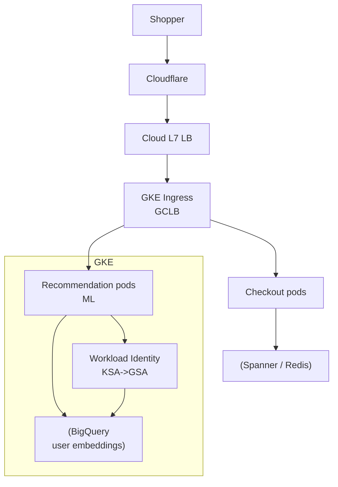

# Zalando — Fashion Commerce on Kubernetes (GKE)

> **Category:** Case Study / E-commerce

| Field | Detail |
|-------|--------|
| **Industry** | Fashion / E-commerce |
| **Region** | Germany (Europe, GCP) |
| **Adoption** | 2021 (GKE) |
| **Scale** | 250+ services ~ 50M+ active customers |

## Who & Why K8s

Zalando runs Europe's biggest fashion e-commerce platform. They moved to **GKE** to break their monolith into microservices and standardize their European footprint. GKE (GCP) won on BigQuery/data integration — Zalando's recommendation and personalization engines needed tight GCP data-warehouse coupling.

## Journey

1. Late 2020: picked GKE for the European footprint.
2. 2021: broke the monolith; 250+ services onto GKE.
3. Present: microservices per domain (fashion, checkout, recommendations) on GKE.

## Architecture

- Clusters: regional GKE clusters (europe-west) per environment.
- Identity: Workload Identity binds recommendation service accounts to GCP service accounts for BigQuery.
- ML: recommendation engine runs Spark-on-K8s reading/writing BigQuery embeddings.

## Tooling

- Argo CD for GitOps.
- Prometheus + Grafana; BigQuery-native dashboards for recommendations.
- Vault + SOPS for secrets.

## Key Decisions

- GKE over EKS — BigQuery + recommendation ML was the deciding factor for a data-first fashion retailer.
- Workload Identity — no recommender service carries GCP keys.
- Regional clusters (not zonal) — 99.95% for checkout.

## Interview Angle

Zalando's platform team said GKE + Workload Identity let them delete a whole category of security tickets: the recommendation engine, which reads user embeddings from BigQuery, never holds a GCP key — it gets short-lived tokens bound to a Kubernetes service account.

## Related Resources
- [Companies Using Kubernetes](../companies-using-kubernetes.md)
- [GKE](../09-cloud-integrations/gke.md)
- [GitOps](../15-advanced-patterns/gitops.md)
