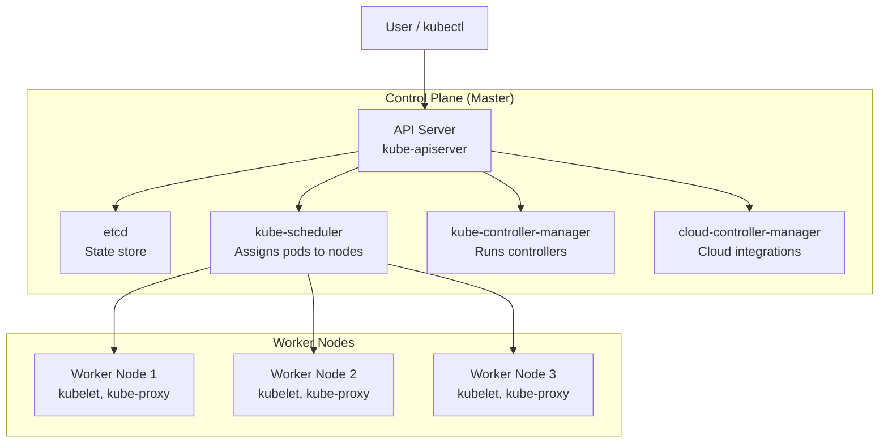

# Complete Kubernetes Encyclopedia

> **Everything you need to know about Kubernetes — from core concepts to production troubleshooting, interview prep, company case studies, and real-world incident analysis.**
> Inspired by the architecture of [All-AWS-Services-Explained](https://github.com/WhoisMonesh/All-AWS-Services-Explained)

---

## Table of Contents

| # | Category | Topics | Files |
|---|----------|--------|-------|
| 1 | [Kubernetes Overview](#kubernetes-overview) | What is Kubernetes, History, CNCF Landscape | 1 |
| 2 | [Core Concepts](01-core-concepts/README.md) | Pods, ReplicaSets, Deployments, Namespaces, Services, Labels, Annotations, Taints/Tolerations, Affinity, Quotas | 18 |
| 3 | [Architecture](02-architecture/README.md) | Control Plane, Worker Nodes, kube-apiserver, etcd, Scheduler, Controller Manager, kubelet, kube-proxy, Runtimes | 10 |
| 4 | [Workloads](03-workloads/README.md) | Pods, ReplicaSets, Deployments, StatefulSets, DaemonSets, Jobs, CronJobs, HPA, VPA, KEDA, Cluster Autoscaler | 14 |
| 5 | [Networking](04-networking/README.md) | CNI, Services, DNS/CoreDNS, Ingress, Ingress Controllers, Network Policies | 12 |
| 6 | [Storage](05-storage/README.md) | Volumes, PV, PVC, StorageClasses, CSI Drivers, ConfigMaps, Secrets | 12 |
| 7 | [Security](06-security/README.md) | RBAC, Service Accounts, PSP/PSA, Admission Controllers, Secrets, Certificates, OPA/Gatekeeper, Kyverno | 14 |
| 8 | [Scheduling & Autoscaling](07-scheduling-autoscaling/README.md) | Scheduling, Taints, Affinity, Quotas, HPA, VPA, KEDA, Cluster Autoscaler, Priority | 12 |
| 8 | [Cluster Operations](08-cluster-operations/README.md) | kubelet, Debugging, Backup/Restore, Upgrades | 5 |
| 9 | [Observability](13-observability/README.md) | Monitoring Fundamentals, Prometheus, Grafana, Logging | 4 |
| 10 | [Troubleshooting](14-troubleshooting/README.md) | Debugging Pods, Common Failure Patterns, kubectl, Real Company Incidents (49 case studies) | 6 |
| 11 | [Package Management](10-package-management/README.md) | Helm, Kustomize | 4 |
| 12 | [CI/CD & GitOps](11-ci-cd-gitops/README.md) | CI/CD, Argo CD, Flux, Tekton | 5 |
| 13 | [Supply Chain Security](11-supply-chain/) | Cosign, SBOM, Image Scanning | 3 |
| 14 | [Service Mesh](12-service-mesh/README.md) | Service Mesh, Istio, Linkerd | 3 |
| 15 | [Interview Prep](16-interview-prep/README.md) | CKA, CKAD, CKS, Questions, Cheatsheets | 5 |
| 16 | [Reference & Cheatsheets](#reference-documentation) | API groups, versions, companies, certs, cheatsheets, glossary | 6+ |

**Total: ~290 Kubernetes concepts, components, tools, and patterns across 20 topic categories + reference docs.**

> 💡 *This repository covers 17 categories with 280+ documents including cloud integrations (EKS/GKE/AKS), advanced patterns (CRDs, operators, WASM), 50 real-world incident case studies, and company-specific Kubernetes deployments.*

---

## Added Reference & Playbooks (this pass)

The following playbooks/reference were added to close operational + exam gaps; every link resolves.

| Topic | Location |
|-------|----------|
| **Learning Path** (Zero to Expert, 4 phases, 52 topics) | [`docs/learning-path.md`](docs/learning-path.md) |
| **Tutorial: Nginx + Domain + TLS** (deploy → ingress → cert-manager) | [`examples/tutorials/tutorial-nginx-domain.md`](examples/tutorials/tutorial-nginx-domain.md) |
| **Tutorial: Nginx + Istio** (mTLS, VirtualService, canary) | [`examples/tutorials/tutorial-nginx-istio.md`](examples/tutorials/tutorial-nginx-istio.md) |
| **Tutorial: Full Stack App** (ConfigMap, Secret, PVC, HPA, PDB, monitoring) | [`examples/tutorials/tutorial-full-stack.md`](examples/tutorials/tutorial-full-stack.md) |
| **Amazon EKS Deep Dive** (VPC CNI, IRSA, ALB Controller) | [`09-cloud-integrations/eks-deep-dive.md`](09-cloud-integrations/eks-deep-dive.md) |
| **Google GKE Deep Dive** (Autopilot, Workload Identity) | [`09-cloud-integrations/gke-deep-dive.md`](09-cloud-integrations/gke-deep-dive.md) |
| **Microsoft AKS Deep Dive** (Azure CNI, Workload Identity) | [`09-cloud-integrations/aks-deep-dive.md`](09-cloud-integrations/aks-deep-dive.md) |
| **CRDs** (Custom Resource Definitions, OpenAPI validation) | [`15-advanced-patterns/crds.md`](15-advanced-patterns/crds.md) |
| **Operators** (controllers, Kubebuilder, OLM) | [`15-advanced-patterns/operators.md`](15-advanced-patterns/operators.md) |
| Troubleshooting Encyclopedia — symptom → diagnosis tables (Pods, Net, Control-plane, Nodes, Sched, Storage, Security, Helm, Perf) | [`14-troubleshooting/troubleshooting-encyclopedia.md`](14-troubleshooting/troubleshooting-encyclopedia.md) |
| Disaster Cases — real incidents & runbooks (etcd loss, cert expiry, registry outage, upgrade cascade, PVC loss…) | [`14-troubleshooting/disaster-cases.md`](14-troubleshooting/disaster-cases.md) |
| Real Company Incident Case Studies (49 outages: GitLab, GitHub, Spotify, Slack, Zalando, Roblox, Capital One, Adidas, Netflix, Cloudflare, Tesla, Amazon, Google, Azure, Shopify, Discord, Epic Games, Apple, LinkedIn, Stripe, Twilio, Uber, Airbnb, Pinterest, Reddit, Wayfair, Bloomberg, JPMorgan, Goldman Sachs) | [`14-troubleshooting/incidents/`](14-troubleshooting/incidents/) |
| Full Kubernetes Version History (v1.0 Jul 2015 → current) + release lifecycle/skew | [`kubernetes-versions.md`](kubernetes-versions.md) |
| CKA/CKAD/CKS Exam Walkthrough (domain → command map) | [`16-interview-prep/exam-walkthrough.md`](16-interview-prep/exam-walkthrough.md) |
| kubeadm bootstrap (init/join/HA, certs, upgrades) | [`08-cluster-operations/kubeadm.md`](08-cluster-operations/kubeadm.md) |
| FinOps (cost buckets, right-sizing, spot, allocation, idle nodes) | [`08-cluster-operations/finops.md`](08-cluster-operations/finops.md) |
| Backup & DR runbook (etcd + Velero + restore) | [`08-cluster-operations/backup-disaster-recovery.md`](08-cluster-operations/backup-disaster-recovery.md) |
| Gateway API Implementations (controller matrix) | [`04-networking/gateway-api-implementations.md`](04-networking/gateway-api-implementations.md) |
| WASM as a workload | [`15-advanced-patterns/wasm.md`](15-advanced-patterns/wasm.md) |
| OCI Artifacts (images, charts, sigs, SBOM, WASM) | [`10-package-management/oci.md`](10-package-management/oci.md) |
| Multi-Cluster federation | [`12-service-mesh/multicluster.md`](12-service-mesh/multicluster.md) |
| Supply Chain / Cosign (keyless signing + SBoM) | [`11-supply-chain/cosign.md`](11-supply-chain/cosign.md) |
| SBOM (Software Bill of Materials) | [`11-supply-chain/sbom.md`](11-supply-chain/sbom.md) |
| Container Image Scanning (Trivy, Grype, CI/CD) | [`11-supply-chain/image-scanning.md`](11-supply-chain/image-scanning.md) |
| Security overview (defense in depth, PSA, etcd encryption) | [`06-security/security.md`](06-security/security.md) |
| Pod Security Context (runAsUser, readOnlyRootFilesystem, seccomp) | [`06-security/pod-security-context.md`](06-security/pod-security-context.md) |
| HPA/VPA/KEDA + Cluster Autoscaler | [`07-scheduling-autoscaling/hpa-vpa.md`](07-scheduling-autoscaling/hpa-vpa.md) |
| Resource Requests/Limits & QoS | [`07-scheduling-autoscaling/resource-management.md`](07-scheduling-autoscaling/resource-management.md) |
| Observability overview (golden signals, OTel, Prometheus) | [`13-observability/observability.md`](13-observability/observability.md) |
| Chaos Engineering (experiments, Chaos Mesh, PDB) | [`15-advanced-patterns/chaos-engineering.md`](15-advanced-patterns/chaos-engineering.md) |
| Troubleshooting Cheat Sheet (90-second commands) | [`cheat-sheets/troubleshooting.md`](cheat-sheets/troubleshooting.md) |
| K8s Glossary (terms, acronyms, concepts) | [`cheat-sheets/glossary.md`](cheat-sheets/glossary.md) |
| Lab Workbook (5 hands-on labs: deploy, troubleshoot, RBAC, Helm, GitOps) | [`examples/common-patterns/lab-instructions.md`](examples/common-patterns/lab-instructions.md) |
| Certification Study Plan (CKA/CKAD/CKS 4-week plans) | [`docs/certification-study-plan.md`](docs/certification-study-plan.md) |
| Security Hardening Guide (defense in depth, RBAC, Network Policies, Pod Security) | [`docs/security-hardening-guide.md`](docs/security-hardening-guide.md) |
| Performance Tuning Guide (HPA, networking, storage, monitoring) | [`docs/performance-tuning-guide.md`](docs/performance-tuning-guide.md) |
| Advanced YAML Examples (multi-container, init, StatefulSet, DaemonSet, HPA) | [`docs/advanced-yaml-examples.md`](docs/advanced-yaml-examples.md) |

## Kubernetes Overview

### What Is Kubernetes?

**Kubernetes** (K8s) is an open-source **container orchestration platform** that automates the deployment, scaling, and management of containerized applications. Originally designed by Google and now maintained by the Cloud Native Computing Foundation (CNCF), Kubernetes groups containers into **logical units** for easy management across clusters of hosts.

### Why It Exists

| Problem | Before Kubernetes | Kubernetes Solution |
|---------|------------------|---------------------|
| Scaling containers | Manual scaling | Auto-scaling with HPA, VPA, KEDA |
| Container failures | Manual intervention | Self-healing with restarts and rescheduling |
| Service discovery | Manual IP tracking | DNS-based service discovery |
| Rolling updates | Downtime-prone | Zero-downtime rolling updates |
| Networking | Manual config | Pod networking with CNI |
| Storage | Hard-coded volumes | Dynamic provisioning with StorageClasses |
| Configuration | Environment-specific files | ConfigMaps and Secrets |
| Multi-cloud | Vendor lock-in | Portable deployments |

---

## The Kubernetes Control Plane

---

## Complete K8s Component Index

> See [COMPLETE-INDEX.md](COMPLETE-INDEX.md) for the exhaustive, categorized list of every Kubernetes concept, component, tool, and pattern covered.

## Reference Documentation

| Reference | Description |
|-----------|-------------|
| [Kubernetes Certifications](kubernetes-certifications.md) | CKA, CKAD, CKS exam paths, domains, and study guides |
| [Kubernetes Version Compatibility](kubernetes-versions.md) | Version release cycles, skew policy, upgrade paths |
| [Companies Using Kubernetes](companies-using-kubernetes.md) | Major companies and their Kubernetes adoption |
| [K8s API Groups Reference](api-groups-reference.md) | All API groups, resources, and verbs |
| [kubectl Cheatsheet](cheat-sheets/kubectl.md) | Complete kubectl command reference |
| [YAML Cheatsheet](cheat-sheets/yaml.md) | Kubernetes YAML quick reference |

---

## Certification Roadmap

### CNCF Certifications

| Exam | Focus | Prerequisite | Link |
|------|-------|--------------|------|
| **CKA** - Certified Kubernetes Administrator | Cluster administration | — | [curriculum](kubernetes-certifications.md) |
| **CKAD** - Certified Kubernetes Application Developer | Application development | — | [curriculum](kubernetes-certifications.md) |
| **CKS** - Certified Kubernetes Security Specialist | Security | CKA required | [curriculum](kubernetes-certifications.md) |

### Learning Path

1. **Start with fundamentals**: Core Concepts → Architecture
2. **Become a developer**: Workloads → Networking → Storage → Package Management
3. **Become an admin**: Cluster Operations → Scheduling & Autoscaling → Observability
4. **Deepen expertise**: Security → Service Mesh → Advanced Patterns → GitOps
5. **Master debugging**: Troubleshooting → Real Incidents
6. **Ace interviews**: Interview Prep (CKA/CKAD/CKS)
7. **Learn from others**: Company Cases

---

## Companies Using Kubernetes

| Company | Use Case |
|---------|----------|
| [Netflix](companies-using-kubernetes.md) | Microservices, Spinnaker on K8s |
| [Spotify](companies-using-kubernetes.md) | Backend services, data infrastructure |
| [Airbnb](companies-using-kubernetes.md) | Containerized microservices |
| [Shopify](companies-using-kubernetes.md) | E-commerce platform, fraud detection |
| [Pinterest](companies-using-kubernetes.md) | Big data, ML workloads |
| [Reddit](companies-using-kubernetes.md) | Microservices migration |
| [IBM](companies-using-kubernetes.md) | Hybrid cloud, Watson |
| [Capital One](companies-using-kubernetes.md) | Financial services, compliance |
| [Boeing](companies-using-kubernetes.md) | Aerospace, HPC workloads |
| [Adidas](companies-using-kubernetes.md) | E-commerce platform |
| [Booking.com](companies-using-kubernetes.md) | Travel booking, microservices |
| [Zalando](companies-using-kubernetes.md) | Fashion e-commerce, event-driven |

> See [Companies Using Kubernetes](companies-using-kubernetes.md) for the full list.

---

## Real Incidents & Learnings

Real-world cluster outages and their root causes map to the troubleshooting + operations docs below:

| Pattern | Root cause | Where it's covered |
|----------|------------|--------------------|
| K8s node pool misconfiguration (e.g. GitHub 2022) | Wrong labels/taints → scheduler can't place Pods | [Troubleshooting patterns](14-troubleshooting/troubleshooting-patterns.md) · [Cluster ops](08-cluster-operations/README.md) |
| etcd corruption / quorum loss (e.g. GitLab 2023) | No off-cluster etcd backup + restore plan | [Backup & Restore](08-cluster-operations/backup-restore.md) · [etcd](02-architecture/etcd.md) |
| Pod networking plugin failure (e.g. AWS EKS) | CNI/Calico daemon down / bad config | [CNI & kube-proxy](04-networking/cni-kube-proxy.md) · [CNI plugins](04-networking/cni-plugins.md) |
| Resource limits misconfigured (e.g. Slack migration) | CPU throttling / OOM | [Resources](07-scheduling-autoscaling/resources.md) · [Troubleshooting](14-troubleshooting/troubleshooting-patterns.md) |
| Kubernetes security breaches (e.g. Tesla 2018) | Exposed dashboard + no RBAC | [Security](06-security/README.md) · [RBAC](06-security/rbac.md) |

---

## Getting Started

1. **Browse by category** — Use the table of contents above to navigate to your area of interest
2. **Search for concepts** — Use GitHub search or the [Complete Index](COMPLETE-INDEX.md)
3. **Deep dive** — Check the Reference Documentation section for detailed specs
4. **Practice** — See [examples/](examples/) for YAML templates and [cheat-sheets/](cheat-sheets/) for quick references
5. **Interview prep** — Visit [16-interview-prep](16-interview-prep/README.md) for CKA/CKAD/CKS guides

### Document Structure

Each concept document follows this structure:
- **What It Is** — Simple, one-line definition
- **Why It Exists** — The problem it solves
- **Architecture** — Visual diagram with Mermaid
- **Key Features** — Bullet points of important capabilities
- **When to Use It** — Ideal use cases
- **Code Example** — `kubectl` commands, YAML manifests, and CLI snippets
- **Best Practices** — Operational guidance
- **Common Issues & Solutions** — Real-world problems and fixes
- **Interview Questions** — Common Q&A (where relevant)
- **Related Concepts** — Cross-references to connected topics

---

## Kubernetes Certification Guides

See [kubernetes-certifications.md](kubernetes-certifications.md) for detailed CKA, CKAD, and CKS exam blueprints, study plans, and practice questions.

---

## License

Educational reference for Kubernetes practitioners, administrators, and developers preparing for CNCF certifications.

Use `git clone https://github.com/WhoisMonesh/K8S-Everything` to clone this repository.

