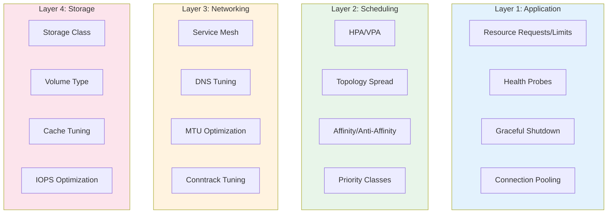

# Kubernetes Performance Tuning Guide

> **Category:** Performance / Optimization
> Practical guide to tuning Kubernetes for speed, efficiency, and cost.

## Performance Layers



---

## Layer 1: Application Tuning

### 1.1 Resource Requests/Limits

```yaml
# Right-size based on actual usage
resources:
  requests:
    cpu: "100m"      # guaranteed CPU
    memory: "128Mi"  # guaranteed memory
  limits:
    cpu: "500m"      # burstable CPU (optional)
    memory: "256Mi"  # hard limit (OOM kill)
```

**Rules:**
- **CPU requests**: Set to 95th percentile usage (not max)
- **CPU limits**: Optional for latency-sensitive workloads (throttle risk)
- **Memory requests**: Set to 99th percentile usage
- **Memory limits**: Always set (OOM kill vs. node eviction)

### 1.2 Health Probes

```yaml
# Liveness: restart if unhealthy
livenessProbe:
  httpGet:
    path: /healthz
    port: 8080
  initialDelaySeconds: 10
  periodSeconds: 10
  failureThreshold: 3

# Readiness: stop traffic if not ready
readinessProbe:
  httpGet:
    path: /ready
    port: 8080
  initialDelaySeconds: 5
  periodSeconds: 5
  failureThreshold: 3

# Startup: slow-starting apps
startupProbe:
  httpGet:
    path: /healthz
    port: 8080
  failureThreshold: 30
  periodSeconds: 10
```

### 1.3 Graceful Shutdown

```yaml
# Handle SIGTERM properly
containers:
- name: app
  lifecycle:
    preStop:
      exec:
        command: ["sh", "-c", "sleep 5"]  # wait for LB deregistration
  terminationGracePeriodSeconds: 30
```

---

## Layer 2: Scheduling Tuning

### 2.1 HPA Tuning

```yaml
apiVersion: autoscaling/v2
kind: HorizontalPodAutoscaler
metadata:
  name: app-hpa
spec:
  scaleTargetRef:
    apiVersion: apps/v1
    kind: Deployment
    name: app
  minReplicas: 3
  maxReplicas: 50
  metrics:
  - type: Resource
    resource:
      name: cpu
      target:
        type: Utilization
        averageUtilization: 70
  behavior:
    scaleUp:
      stabilizationWindowSeconds: 60
      policies:
      - type: Pods
        value: 4
        periodSeconds: 60
    scaleDown:
      stabilizationWindowSeconds: 300
      policies:
      - type: Percent
        value: 10
        periodSeconds: 60
```

### 2.2 Topology Spread Constraints

```yaml
# Spread pods evenly across zones
topologySpreadConstraints:
- maxSkew: 1
  topologyKey: topology.kubernetes.io/zone
  whenUnsatisfiable: DoNotSchedule
  labelSelector:
    matchLabels:
      app: my-app
```

### 2.3 Priority Classes

```yaml
apiVersion: scheduling.k8s.io/v1
kind: PriorityClass
metadata:
  name: high-priority
value: 1000000
globalDefault: false
description: "High priority for critical workloads"
---
# Critical pod
priorityClassName: high-priority
```

---

## Layer 3: Networking Tuning

### 3.1 CoreDNS Tuning

```yaml
# Scale CoreDNS based on cluster size
apiVersion: apps/v1
kind: Deployment
metadata:
  name: coredns
  namespace: kube-system
spec:
  replicas: 3  # Increase for large clusters
  template:
    spec:
      containers:
      - name: coredns
        resources:
          requests:
            cpu: 100m
            memory: 128Mi
          limits:
            cpu: 500m
            memory: 512Mi
```

### 3.2 NodelocalDNS (DNS Cache)

```yaml
# Deploy NodelocalDNS to reduce CoreDNS load
apiVersion: apps/v1
kind: DaemonSet
metadata:
  name: nodelocaldns
  namespace: kube-system
spec:
  template:
    spec:
      containers:
      - name: nodelocaldns
        args:
        - -conf
        - /etc/coredns/Corefile
        - -dnsupstream
        - "10.96.0.10:53"  # CoreDNS ClusterIP
```

### 3.3 Service Mesh Tuning (Istio)

```yaml
# Connection pooling
apiVersion: networking.istio.io/v1beta1
kind: DestinationRule
metadata:
  name: app
spec:
  host: app
  trafficPolicy:
    connectionPool:
      tcp:
        maxConnections: 1000
        connectTimeout: 5s
      http:
        h2UpgradePolicy: DEFAULT
        http1MaxPendingRequests: 1024
        http2MaxRequests: 1024
        maxRequestsPerConnection: 100
        maxRetries: 3
```

---

## Layer 4: Storage Tuning

### 4.1 Storage Class Selection

| StorageClass | Use Case | Performance |
|--------------|----------|-------------|
| gp3 (AWS) | General purpose | Good IOPS, low cost |
| io1 (AWS) | High IOPS | High IOPS, expensive |
| premium (GCP) | SSD | Good performance |
| standard (GCP) | HDD | Low cost, low performance |
| Standard_LRS (Azure) | General purpose | Good balance |

### 4.2 Volume Performance

```yaml
# High-performance storage
apiVersion: storage.k8s.io/v1
kind: StorageClass
metadata:
  name: high-performance
provisioner: ebs.csi.aws.com
parameters:
  type: io1
  iopsPerGB: "50"
  encrypted: "true"
  fsType: ext4
reclaimPolicy: Retain
allowVolumeExpansion: true
volumeBindingMode: WaitForFirstConsumer
```

---

## Performance Monitoring

### Key Metrics

```bash
# Node performance
kubectl top nodes
kubectl top pods -A --sort-by=cpu

# HPA status
kubectl describe hpa <name>

# PDB status
kubectl get pdb -A

# etcd performance
ETCDCTL_API=3 etcdctl endpoint status --write-out=table

# API server latency
kubectl get --raw /metrics | grep apiserver_request_duration_seconds
```

### Prometheus Queries

```promql
# CPU usage by namespace
sum(rate(container_cpu_usage_seconds_total{namespace!=""}[5m])) by (namespace)

# Memory usage by namespace
sum(container_memory_working_set_bytes{namespace!=""}) by (namespace)

# Pod restarts
sum(kube_pod_container_status_restarts_total) by (pod)

# API server latency
histogram_quantile(0.99, rate(apiserver_request_duration_seconds_bucket[5m]))
```

## Quick Tuning Checklist

```bash
# 1. Resource requests set?
kubectl get pods -A -o json | jq '.items[] | select(.spec.containers[].resources.requests==null) | .metadata.name'

# 2. HPA configured?
kubectl get hpa -A

# 3. PDB configured?
kubectl get pdb -A

# 4. Topology spread?
kubectl get pods -o json | jq '.items[] | select(.spec.topologySpreadConstraints!=null) | .metadata.name'

# 5. Health probes set?
kubectl get pods -A -o json | jq '.items[] | select(.spec.containers[].livenessProbe==null) | .metadata.name'

# 6. NodelocalDNS running?
kubectl get ds nodelocaldns -n kube-system

# 7. CoreDNS scaled?
kubectl get deploy coredns -n kube-system -o jsonpath='{.spec.replicas}'
```

## Related

- [FinOps](../08-cluster-operations/finops.md)
- [HPA/VPA](../07-scheduling-autoscaling/hpa-vpa.md)
- [Resource Management](../07-scheduling-autoscaling/resource-management.md)
- [Incident Case Studies](../14-troubleshooting/incidents/README.md)
