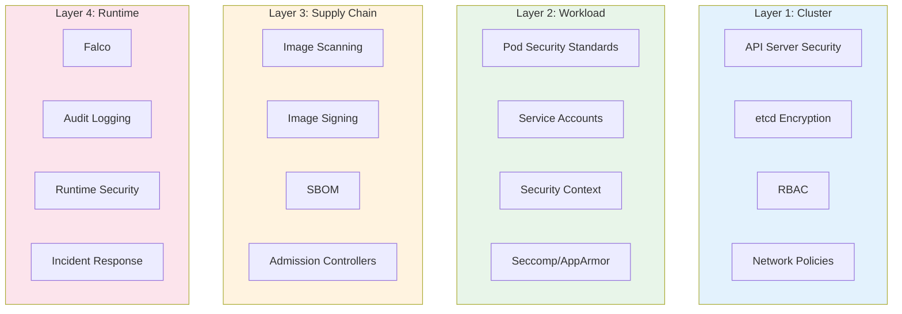

# Kubernetes Security Hardening Guide

> **Category:** Security / Hardening
> A practical, step-by-step guide to hardening your Kubernetes cluster.

## Security Layers



---

## Layer 1: Cluster Security

### 1.1 API Server Security

```bash
# Disable anonymous auth
--anonymous-auth=false

# Enable audit logging
--audit-log-path=/var/log/kubernetes/audit.log
--audit-log-maxage=30
--audit-log-maxbackup=10
--audit-log-maxsize=100

# Disable insecure port
--insecure-port=0

# Enable RBAC
--authorization-mode=Node,RBAC
```

### 1.2 etcd Encryption

```yaml
# /etc/kubernetes/encryption-config.yaml
apiVersion: apiserver.config.k8s.io/v1
kind: EncryptionConfiguration
resources:
- resources:
  - secrets
  - configmaps
  providers:
  - aescbc:
      keys:
      - name: key1
        secret: <base64-encoded-secret>
  - identity: {}
```

### 1.3 RBAC Hardening

```bash
# Audit all ClusterRoleBindings
kubectl get clusterrolebindings -o json | jq '.items[] | select(.roleRef.name=="cluster-admin") | .subjects'

# Check for wildcard permissions
kubectl get clusterroles -o json | jq '.items[] | select(.rules[]?.verbs[]=="*" and .rules[]?.resources[]=="*") | .metadata.name'

# Use least privilege
kubectl create role pod-reader --verb=get,list,watch --resource=pods
kubectl create rolebinding pod-reader --role=pod-reader --serviceaccount=default:my-sa
```

### 1.4 Network Policies

```yaml
# Default deny all ingress + egress
apiVersion: networking.k8s.io/v1
kind: NetworkPolicy
metadata:
  name: default-deny-all
  namespace: production
spec:
  podSelector: {}
  policyTypes:
  - Ingress
  - Egress
---
# Allow DNS
apiVersion: networking.k8s.io/v1
kind: NetworkPolicy
metadata:
  name: allow-dns
  namespace: production
spec:
  podSelector: {}
  policyTypes:
  - Egress
  egress:
  - to: []
    ports:
    - protocol: UDP
      port: 53
    - protocol: TCP
      port: 53
---
# Allow ingress from same namespace
apiVersion: networking.k8s.io/v1
kind: NetworkPolicy
metadata:
  name: allow-same-namespace
  namespace: production
spec:
  podSelector: {}
  policyTypes:
  - Ingress
  ingress:
  - from:
    - podSelector: {}
```

---

## Layer 2: Workload Security

### 2.1 Pod Security Standards

```yaml
# Enforce restricted PSS on namespace
apiVersion: v1
kind: Namespace
metadata:
  name: production
  labels:
    pod-security.kubernetes.io/enforce: restricted
    pod-security.kubernetes.io/audit: restricted
    pod-security.kubernetes.io/warn: restricted
```

### 2.2 Security Context

```yaml
apiVersion: v1
kind: Pod
metadata:
  name: secure-pod
spec:
  securityContext:
    runAsNonRoot: true
    runAsUser: 10001
    runAsGroup: 10001
    fsGroup: 10001
    seccompProfile:
      type: RuntimeDefault
  containers:
  - name: app
    image: nginx:1.25
    securityContext:
      allowPrivilegeEscalation: false
      readOnlyRootFilesystem: true
      capabilities:
        drop:
        - ALL
        add:
        - NET_BIND_SERVICE
    resources:
      requests:
        cpu: 100m
        memory: 128Mi
      limits:
        cpu: 500m
        memory: 256Mi
```

### 2.3 Service Accounts

```yaml
apiVersion: v1
kind: ServiceAccount
metadata:
  name: app-sa
  namespace: production
  annotations:
    # Disable automounting of API credentials
    kubernetes.io/enforce-mountable-secrets: "true"
automountServiceAccountToken: false
---
# If the pod needs API access, create a separate SA with minimal permissions
apiVersion: rbac.authorization.k8s.io/v1
kind: Role
metadata:
  name: pod-reader
  namespace: production
rules:
- apiGroups: [""]
  resources: ["pods"]
  verbs: ["get", "list", "watch"]
---
apiVersion: rbac.authorization.k8s.io/v1
kind: RoleBinding
metadata:
  name: pod-reader
  namespace: production
subjects:
- kind: ServiceAccount
  name: app-sa
  namespace: production
roleRef:
  kind: Role
  name: pod-reader
  apiGroup: rbac.authorization.k8s.io
```

---

## Layer 3: Supply Chain Security

### 3.1 Image Scanning (Trivy)

```bash
# Scan image before deployment
trivy image --severity HIGH,CRITICAL nginx:1.25

# CI/CD integration
trivy image --exit-code 1 --severity CRITICAL nginx:1.25
```

### 3.2 Image Signing (Cosign)

```bash
# Sign image
cosign sign --key cosign.key myregistry/nginx:1.25

# Verify image
cosign verify --key cosign.pub myregistry/nginx:1.25
```

### 3.3 Admission Controllers (Kyverno)

```yaml
# Require image signing
apiVersion: kyverno.io/v1
kind: ClusterPolicy
metadata:
  name: require-image-signing
spec:
  validationFailureAction: enforce
  rules:
  - name: check-image-signature
    match:
      any:
      - resources:
          kinds:
          - Pod
    verifyImages:
    - imageReferences:
      - "myregistry/*"
      attestors:
      - entries:
        - keys:
            publicKeys: |-
              -----BEGIN PUBLIC KEY-----
              ...
              -----END PUBLIC KEY-----
```

---

## Layer 4: Runtime Security

### 4.1 Falco

```bash
# Install Falco
helm repo add falcosecurity https://falcosecurity.github.io/charts
helm install falco falcosecurity/falco --namespace falco --create-namespace

# Custom rule: detect shell in container
- rule: Shell in Container
  desc: Detect shell execution in container
  condition: >
    spawned_process and container and proc.name in (bash, sh, zsh)
  output: >
    Shell spawned in container
    (user=%user.name container=%container.name shell=%proc.name)
  priority: WARNING
```

### 4.2 Audit Logging

```yaml
# /etc/kubernetes/audit-policy.yaml
apiVersion: audit.k8s.io/v1
kind: Policy
rules:
- level: RequestResponse
  resources:
  - group: ""
    resources: ["secrets", "configmaps"]
- level: Metadata
  resources:
  - group: ""
    resources: ["pods", "services"]
- level: None
  resources:
  - group: ""
    resources: ["events"]
```

---

## Quick Security Checklist

```bash
# 1. RBAC: No wildcard permissions
kubectl get clusterroles -o json | jq '.items[] | select(.rules[]?.verbs[]=="*" and .rules[]?.resources[]=="*") | .metadata.name'

# 2. Network Policies: Default deny
kubectl get networkpolicy -A | grep default-deny

# 3. Pod Security: Restricted PSS
kubectl get namespaces -L pod-security.kubernetes.io/enforce

# 4. Secrets: Not in plaintext
kubectl get secrets -A -o json | jq '.items[] | select(.type=="Opaque") | .metadata.name'

# 5. Images: Scanned
trivy image --severity HIGH,CRITICAL <image>

# 6. Audit: Enabled
ps aux | grep kube-apiserver | grep audit

# 7. etcd: Encrypted
cat /etc/kubernetes/encryption-config.yaml

# 8. Service Accounts: No automount
kubectl get serviceaccounts -A -o json | jq '.items[] | select(.automountServiceAccountToken!=false) | .metadata.name'
```

## Related

- [Security Overview](../06-security/security.md)
- [RBAC](../06-security/rbac.md)
- [Network Policies](../04-networking/network-policies.md)
- [Incident Case Studies](../14-troubleshooting/incidents/README.md)
