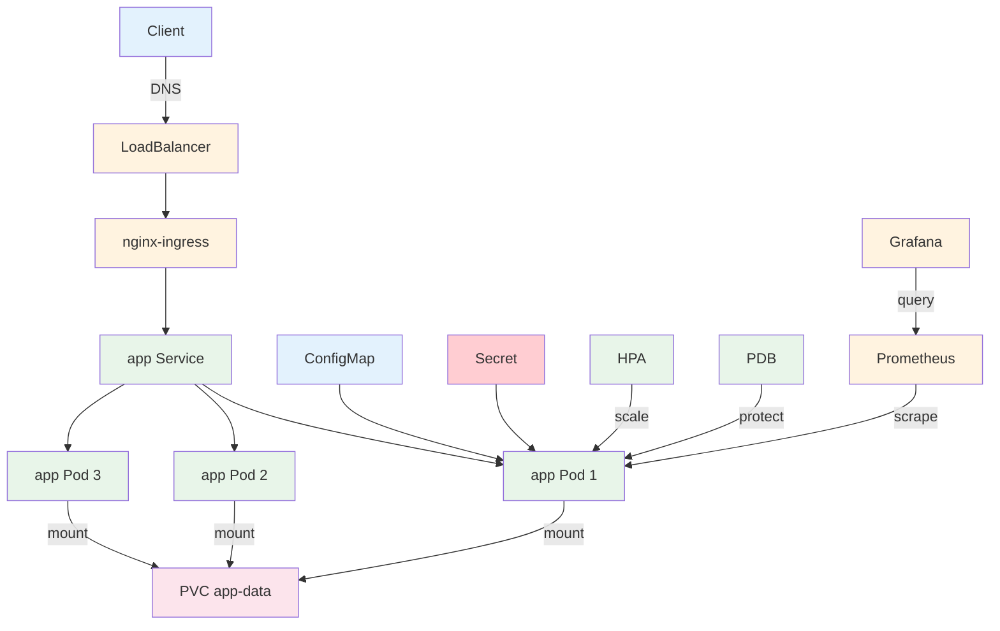

# Tutorial: Full Stack App — Deploy, Secure, Scale, Monitor

> **Category:** Tutorial / Hands-On
> **Time:** 120 minutes
> **Prerequisites:** kubectl, Helm 3, a Kubernetes cluster

This tutorial deploys a complete application stack: deployment, service, ingress, ConfigMap, Secret, PVC, HPA, PDB, monitoring, and CI/CD.

---

## Step 1: Create Namespace

```bash
kubectl create namespace full-stack
kubectl config set-context --current --namespace=full-stack
```

## Step 2: Create ConfigMap + Secret

```yaml
# save as config.yaml
apiVersion: v1
kind: ConfigMap
metadata:
  name: app-config
data:
  APP_ENV: production
  LOG_LEVEL: info
  DB_HOST: postgres-svc
  DB_PORT: "5432"
---
apiVersion: v1
kind: Secret
metadata:
  name: app-secret
type: Opaque
data:
  DB_USER: cG9zdGdyZXM=        # base64: postgres
  DB_PASS: c3VwZXJzZWNyZXQ=     # base64: supersecret
  API_KEY: bXktYXBpLWtleQ==     # base64: my-api-key
```

```bash
kubectl apply -f config.yaml
kubectl get configmap,secret app-config,app-secret
```

## Step 3: Create PVC

```yaml
# save as storage.yaml
apiVersion: v1
kind: PersistentVolumeClaim
metadata:
  name: app-data
spec:
  accessModes:
  - ReadWriteOnce
  resources:
    requests:
      storage: 1Gi
```

```bash
kubectl apply -f storage.yaml
kubectl get pvc app-data
# Wait for STATUS: Bound
```

## Step 4: Deploy Application

```yaml
# save as app-deployment.yaml
apiVersion: apps/v1
kind: Deployment
metadata:
  name: app
  labels:
    app: app
    version: v1
spec:
  replicas: 3
  selector:
    matchLabels:
      app: app
  template:
    metadata:
      labels:
        app: app
        version: v1
      annotations:
        prometheus.io/scrape: "true"
        prometheus.io/port: "8080"
        prometheus.io/path: "/metrics"
    spec:
      securityContext:
        runAsNonRoot: true
        runAsUser: 10001
      containers:
      - name: app
        image: nginx:1.25-alpine
        ports:
        - containerPort: 8080
          name: http
        envFrom:
        - configMapRef:
            name: app-config
        - secretRef:
            name: app-secret
        volumeMounts:
        - name: app-data
          mountPath: /usr/share/nginx/html
        resources:
          requests:
            cpu: 100m
            memory: 128Mi
          limits:
            cpu: 500m
            memory: 256Mi
        livenessProbe:
          httpGet:
            path: /
            port: 80
          initialDelaySeconds: 5
          periodSeconds: 10
        readinessProbe:
          httpGet:
            path: /
            port: 80
          initialDelaySeconds: 2
          periodSeconds: 5
        securityContext:
          allowPrivilegeEscalation: false
          readOnlyRootFilesystem: false
          capabilities:
            drop:
            - ALL
      volumes:
      - name: app-data
        persistentVolumeClaim:
          claimName: app-data
```

```bash
kubectl apply -f app-deployment.yaml
kubectl get pods -o wide
# Wait until all 3 pods are Running
```

## Step 5: Create Service

```yaml
# save as app-service.yaml
apiVersion: v1
kind: Service
metadata:
  name: app
  labels:
    app: app
spec:
  selector:
    app: app
  ports:
  - name: http
    port: 80
    targetPort: http
  type: ClusterIP
```

```bash
kubectl apply -f app-service.yaml
kubectl get svc,ep app
```

## Step 6: Create Ingress

```yaml
# save as app-ingress.yaml
apiVersion: networking.k8s.io/v1
kind: Ingress
metadata:
  name: app
  annotations:
    kubernetes.io/ingress.class: nginx
    cert-manager.io/cluster-issuer: letsencrypt-staging
    nginx.ingress.kubernetes.io/ssl-redirect: "true"
spec:
  ingressClassName: nginx
  tls:
  - hosts:
    - app.example.com
    secretName: app-tls
  rules:
  - host: app.example.com
    http:
      paths:
      - path: /
        pathType: Prefix
        backend:
          service:
            name: app
            port:
              number: 80
```

```bash
kubectl apply -f app-ingress.yaml
kubectl get ingress app
```

## Step 7: HPA (Autoscaler)

```yaml
# save as hpa.yaml
apiVersion: autoscaling/v2
kind: HorizontalPodAutoscaler
metadata:
  name: app-hpa
spec:
  scaleTargetRef:
    apiVersion: apps/v1
    kind: Deployment
    name: app
  minReplicas: 3
  maxReplicas: 10
  metrics:
  - type: Resource
    resource:
      name: cpu
      target:
        type: Utilization
        averageUtilization: 70
  behavior:
    scaleUp:
      stabilizationWindowSeconds: 60
      policies:
      - type: Pods
        value: 2
        periodSeconds: 60
    scaleDown:
      stabilizationWindowSeconds: 300
```

```bash
kubectl apply -f hpa.yaml
kubectl get hpa -w
```

## Step 8: PDB (Pod Disruption Budget)

```yaml
# save as pdb.yaml
apiVersion: policy/v1
kind: PodDisruptionBudget
metadata:
  name: app-pdb
spec:
  minAvailable: 2
  selector:
    matchLabels:
      app: app
```

```bash
kubectl apply -f pdb.yaml
kubectl get pdb
```

## Step 9: Resource Quota

```yaml
# save as quota.yaml
apiVersion: v1
kind: ResourceQuota
metadata:
  name: app-quota
spec:
  hard:
    requests.cpu: "2"
    requests.memory: 2Gi
    limits.cpu: "4"
    limits.memory: 4Gi
    pods: "20"
    services: "10"
    persistentvolumeclaims: "5"
---
apiVersion: v1
kind: LimitRange
metadata:
  name: app-limits
spec:
  limits:
  - default:
      cpu: 500m
      memory: 256Mi
    defaultRequest:
      cpu: 100m
      memory: 128Mi
    type: Container
```

```bash
kubectl apply -f quota.yaml
kubectl get resourcequota,limitrange
```

## Step 10: Monitoring (Prometheus + Grafana)

```bash
# Install kube-prometheus-stack (includes Prometheus + Grafana + AlertManager)
helm repo add prometheus-community https://prometheus-community.github.io/helm-charts
helm repo update

helm install monitoring prometheus-community/kube-prometheus-stack \
  --namespace monitoring \
  --create-namespace \
  --set grafana.adminPassword=admin

# Wait for pods
kubectl get pods -n monitoring

# Port-forward Grafana
kubectl port-forward -n monitoring svc/monitoring-grafana 3000:80
# Open http://localhost:3000 (admin/admin)

# Port-forward Prometheus
kubectl port-forward -n monitoring svc/monitoring-kube-prometheus-prometheus 9090:9090
# Open http://localhost:9090
```

### Create ServiceMonitor for your app

```yaml
# save as service-monitor.yaml
apiVersion: monitoring.coreos.com/v1
kind: ServiceMonitor
metadata:
  name: app-monitor
  labels:
    release: monitoring
spec:
  selector:
    matchLabels:
      app: app
  endpoints:
  - port: http
    path: /metrics
    interval: 30s
```

```bash
kubectl apply -f service-monitor.yaml
```

## Step 11: Verify Everything

```bash
# Check all resources
kubectl get all
kubectl get configmap,secret
kubectl get pvc
kubectl get ingress
kubectl get hpa,pdb
kubectl get resourcequota,limitrange
kubectl get servicemonitor

# Test app
curl -H "Host: app.example.com" http://$(kubectl get svc -n ingress-nginx ingress-nginx-controller -o jsonpath='{.status.loadBalancer.ingress[0].ip}')

# Check HPA scaling
kubectl describe hpa app-hpa

# Check Grafana
kubectl port-forward -n monitoring svc/monitoring-grafana 3000:80
# http://localhost:3000 → dashboards → kubernetes
```

## Cleanup

```bash
kubectl delete namespace full-stack
kubectl delete namespace monitoring
helm uninstall monitoring -n monitoring
```

---

## Architecture



## Resources Created

| Resource | Purpose |
|----------|---------|
| Deployment | 3 replicas of nginx app |
| Service | ClusterIP for internal access |
| Ingress | External access via `app.example.com` |
| ConfigMap | Environment variables (non-sensitive) |
| Secret | Credentials (base64 encoded) |
| PVC | Persistent storage for app data |
| HPA | Scale 3-10 pods based on CPU |
| PDB | Minimum 2 pods during disruptions |
| ResourceQuota | Limit total CPU/memory/pods |
| LimitRange | Default resource limits per container |
| ServiceMonitor | Prometheus scraping config |

## Related

- [Tutorial 1: Nginx + Domain](tutorial-nginx-domain.md)
- [Tutorial 2: Nginx + Istio](tutorial-nginx-istio.md)
- [Prometheus](../../13-observability/prometheus.md)
- [Grafana](../../13-observability/grafana.md)
