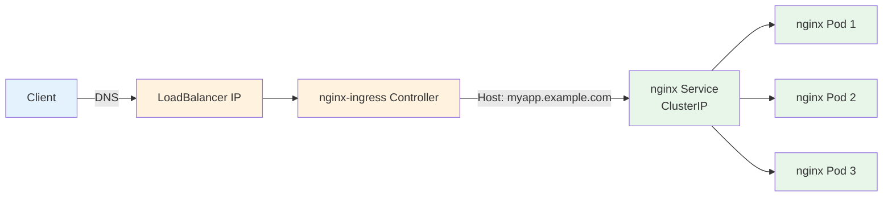

# Tutorial: Deploy Nginx with Domain + TLS

> **Category:** Tutorial / Hands-On
> **Time:** 60 minutes
> **Prerequisites:** kubectl, Helm 3, a domain name, a Kubernetes cluster (minikube/kind/EKS/GKE/AKS)

This tutorial walks you through deploying nginx, exposing it via Ingress with TLS, and accessing it at `myapp.example.com`.

---

## Prerequisites

```bash
# Verify tools
kubectl version --client
helm version
# A running cluster (minikube start, kind create cluster, or cloud cluster)
kubectl cluster-info
```

---

## Step 1: Create Namespace

```bash
kubectl create namespace nginx-tutorial
kubectl config set-context --current --namespace=nginx-tutorial
```

## Step 2: Deploy Nginx

```yaml
# save as nginx-deployment.yaml
apiVersion: apps/v1
kind: Deployment
metadata:
  name: nginx
  labels:
    app: nginx
spec:
  replicas: 3
  selector:
    matchLabels:
      app: nginx
  template:
    metadata:
      labels:
        app: nginx
    spec:
      containers:
      - name: nginx
        image: nginx:1.25-alpine
        ports:
        - containerPort: 80
          name: http
        resources:
          requests:
            cpu: 100m
            memory: 128Mi
          limits:
            cpu: 500m
            memory: 256Mi
        livenessProbe:
          httpGet:
            path: /
            port: 80
          initialDelaySeconds: 5
          periodSeconds: 10
        readinessProbe:
          httpGet:
            path: /
            port: 80
          initialDelaySeconds: 2
          periodSeconds: 5
```

```bash
kubectl apply -f nginx-deployment.yaml
kubectl get pods -o wide
# Wait until all 3 pods are Running
```

## Step 3: Create ClusterIP Service

```yaml
# save as nginx-service.yaml
apiVersion: v1
kind: Service
metadata:
  name: nginx
  labels:
    app: nginx
spec:
  selector:
    app: nginx
  ports:
  - name: http
    port: 80
    targetPort: http
  type: ClusterIP
```

```bash
kubectl apply -f nginx-service.yaml
kubectl get svc,ep nginx
# Verify endpoints show 3 IPs (one per pod)
```

## Step 4: Test Inside the Cluster

```bash
# Quick test from inside
kubectl run curl --rm -it --image=curlimages/curl -- sh
curl http://nginx.nginx-tutorial.svc.cluster.local
# You should see the nginx welcome page HTML
```

## Step 5: Install nginx-ingress Controller (Helm)

```bash
# Add the ingress-nginx Helm repo
helm repo add ingress-nginx https://kubernetes.github.io/ingress-nginx
helm repo update

# Install ingress-nginx controller
helm install ingress-nginx ingress-nginx/ingress-nginx \
  --namespace ingress-nginx \
  --create-namespace \
  --set controller.replicaCount=2

# Wait for the LoadBalancer to get an external IP
kubectl get svc -n ingress-nginx
# Watch: EXTERNAL-IP will change from <pending> to an IP/hostname
```

## Step 6: Create Ingress Resource

```yaml
# save as nginx-ingress.yaml
apiVersion: networking.k8s.io/v1
kind: Ingress
metadata:
  name: nginx
  annotations:
    kubernetes.io/ingress.class: nginx
    nginx.ingress.kubernetes.io/ssl-redirect: "true"
spec:
  ingressClassName: nginx
  rules:
  - host: myapp.example.com
    http:
      paths:
      - path: /
        pathType: Prefix
        backend:
          service:
            name: nginx
            port:
              number: 80
```

```bash
kubectl apply -f nginx-ingress.yaml
kubectl get ingress nginx
# Note the ADDRESS field — this is the ingress controller's external IP
```

## Step 7: DNS Setup

```bash
# Option A: Local (edit /etc/hosts)
echo "$(kubectl get svc -n ingress-nginx ingress-nginx-controller -o jsonpath='{.status.loadBalancer.ingress[0].ip}') myapp.example.com" | sudo tee -a /etc/hosts

# Option B: Real domain — create CNAME or A record
# Point myapp.example.com → <EXTERNAL-IP from kubectl get svc>
```

## Step 8: Test Without TLS

```bash
curl -H "Host: myapp.example.com" http://$(kubectl get svc -n ingress-nginx ingress-nginx-controller -o jsonpath='{.status.loadBalancer.ingress[0].ip}')
# You should see nginx welcome page
```

## Step 9: Install cert-manager + TLS

```bash
# Install cert-manager
helm repo add jetstack https://charts.jetstack.io
helm repo update
helm install cert-manager jetstack/cert-manager \
  --namespace cert-manager \
  --create-namespace \
  --set installCRDs=true

# Wait for cert-manager to be ready
kubectl get pods -n cert-manager
```

### Create ClusterIssuer (Let's Encrypt staging)

```yaml
# save as cluster-issuer.yaml
apiVersion: cert-manager.io/v1
kind: ClusterIssuer
metadata:
  name: letsencrypt-staging
spec:
  acme:
    server: https://acme-staging-v02.api.letsencrypt.org/directory
    email: your-email@example.com
    privateKeySecretRef:
      name: letsencrypt-staging
    solvers:
    - http01:
        ingress:
          class: nginx
```

```bash
kubectl apply -f cluster-issuer.yaml
kubectl get clusterissuer letsencrypt-staging
```

### Update Ingress for TLS

```yaml
# save as nginx-ingress-tls.yaml
apiVersion: networking.k8s.io/v1
kind: Ingress
metadata:
  name: nginx
  annotations:
    kubernetes.io/ingress.class: nginx
    nginx.ingress.kubernetes.io/ssl-redirect: "true"
    cert-manager.io/cluster-issuer: letsencrypt-staging
spec:
  ingressClassName: nginx
  tls:
  - hosts:
    - myapp.example.com
    secretName: nginx-tls
  rules:
  - host: myapp.example.com
    http:
      paths:
      - path: /
        pathType: Prefix
        backend:
          service:
            name: nginx
            port:
              number: 80
```

```bash
kubectl apply -f nginx-ingress-tls.yaml

# Watch certificate provisioning
kubectl get certificate -w
kubectl get certificaterequest -w

# Once READY=True, test with HTTPS
curl -k https://myapp.example.com
```

## Step 10: Verify Everything

```bash
# Check all resources
kubectl get all -n nginx-tutorial
kubectl get ingress nginx
kubectl get certificate
kubectl get clusterissuer

# Test HTTPS
curl -v https://myapp.example.com

# Check TLS cert details
echo | openssl s_client -connect myapp.example.com:443 -servername myapp.example.com 2>/dev/null | openssl x509 -noout -subject -issuer -dates
```

## Cleanup

```bash
kubectl delete namespace nginx-tutorial
helm uninstall ingress-nginx -n ingress-nginx
helm uninstall cert-manager -n cert-manager
kubectl delete clusterissuer letsencrypt-staging
kubectl delete namespace ingress-nginx
kubectl delete namespace cert-manager
```

---

## Architecture



## Related

- [Tutorial 2: Nginx + Istio](tutorial-nginx-istio.md)
- [Tutorial 3: Full Stack](tutorial-full-stack.md)
- [Ingress](../../04-networking/ingress.md)
- [nginx-ingress](../../04-networking/nginx-ingress.md)
