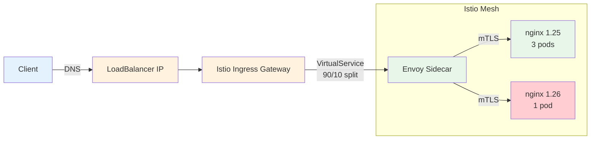

# Tutorial: Nginx + Istio Service Mesh

> **Category:** Tutorial / Hands-On
> **Time:** 90 minutes
> **Prerequisites:** Tutorial 1 completed (or nginx deployed), kubectl, istioctl

This tutorial deploys nginx into Istio, configures mTLS, traffic splitting, and observability.

---

## Prerequisites

```bash
# Verify cluster
kubectl cluster-info
kubectl get nodes

# Verify Tutorial 1 is deployed (or deploy fresh)
kubectl get pods -n nginx-tutorial
```

---

## Step 1: Install Istio

```bash
# Download istioctl
curl -L https://istio.io/downloadIstio | sh -
cd istio-*
export PATH=$PWD/bin:$PATH
istioctl version --remote=false

# Install Istio (demo profile includes gateways + telemetry)
istioctl install --set profile=demo -y

# Verify installation
kubectl get pods -n istio-system
# Expected: istiod, istio-ingressgateway, istio-egressgateway all Running
```

## Step 2: Enable Sidecar Injection

```bash
# Label namespace for automatic sidecar injection
kubectl label namespace nginx-tutorial istio-injection=enabled

# Verify label
kubectl get namespace nginx-tutorial --show-labels
```

## Step 3: Deploy Nginx (Fresh)

```bash
# If you already have nginx from Tutorial 1, skip to Step 4
# Otherwise, deploy fresh:

kubectl create namespace nginx-tutorial 2>/dev/null || true
kubectl config set-context --current --namespace=nginx-tutorial

cat <<EOF | kubectl apply -f -
apiVersion: apps/v1
kind: Deployment
metadata:
  name: nginx
  labels:
    app: nginx
spec:
  replicas: 3
  selector:
    matchLabels:
      app: nginx
  template:
    metadata:
      labels:
        app: nginx
    spec:
      containers:
      - name: nginx
        image: nginx:1.25-alpine
        ports:
        - containerPort: 80
          name: http
---
apiVersion: v1
kind: Service
metadata:
  name: nginx
  labels:
    app: nginx
spec:
  selector:
    app: nginx
  ports:
  - name: http
    port: 80
    targetPort: http
---
apiVersion: networking.k8s.io/v1
kind: Ingress
metadata:
  name: nginx
  annotations:
    kubernetes.io/ingress.class: nginx
spec:
  rules:
  - host: myapp.example.com
    http:
      paths:
      - path: /
        pathType: Prefix
        backend:
          service:
            name: nginx
            port:
              number: 80

kubectl get pods -o wide
# You should see 2/2 containers per pod (nginx + istio-proxy)
```

## Step 4: Verify Sidecar Injection

```bash
# Check sidecar is injected
kubectl get pods -o jsonpath='{range .items[*]}{.metadata.name}{"\t"}{range .spec.containers[*]}{.name}{" "}{end}{"\n"}{end}'
# Output: nginx-xxxxx   nginx istio-proxy

# Check Envoy config
kubectl exec -it deploy/nginx -c istio-proxy -- pilot-agent request GET config_dump | head -50

# Check proxy status
istioctl proxy-status
```

## Step 5: Create Istio Gateway + VirtualService

```yaml
# save as istio-gateway.yaml
apiVersion: networking.istio.io/v1beta1
kind: Gateway
metadata:
  name: nginx-gateway
spec:
  selector:
    istio: ingressgateway
  servers:
  - port:
      number: 80
      name: http
      protocol: HTTP
    hosts:
    - "myapp.example.com"
---
apiVersion: networking.istio.io/v1beta1
kind: VirtualService
metadata:
  name: nginx
spec:
  hosts:
  - "myapp.example.com"
  gateways:
  - nginx-gateway
  http:
  - route:
    - destination:
        host: nginx
        port:
          number: 80
```

```bash
kubectl apply -f istio-gateway.yaml
kubectl get gateway,virtualservice
```

## Step 6: Test Through Istio Gateway

```bash
# Get Istio ingress gateway IP
export INGRESS_HOST=$(kubectl -n istio-system get service istio-ingressgateway -o jsonpath='{.status.loadBalancer.ingress[0].ip}')
export INGRESS_PORT=$(kubectl -n istio-system get service istio-ingressgateway -o jsonpath='{.spec.ports[?(@.name=="http2")].port}')

# Test
curl -s -H "Host: myapp.example.com" http://$INGRESS_HOST:$INGRESS_PORT
# Should return nginx welcome page
```

## Step 7: Enable mTLS (Mutual TLS)

```yaml
# save as istio-mtls.yaml
# PeerAuthentication: enforce mTLS across the namespace
apiVersion: security.istio.io/v1beta1
kind: PeerAuthentication
metadata:
  name: default
  namespace: nginx-tutorial
spec:
  mtls:
    mode: STRICT
---
# DestinationRule: tell Envoy to use mTLS for nginx
apiVersion: networking.istio.io/v1beta1
kind: DestinationRule
metadata:
  name: nginx
spec:
  host: nginx
  trafficPolicy:
    tls:
      mode: ISTIO_MUTUAL
```

```bash
kubectl apply -f istio-mtls.yaml
kubectl get peerauthentication,destinationrule

# Verify mTLS is working
kubectl exec -it deploy/nginx -c istio-proxy -- pilot-agent request GET certificates | head -20
```

## Step 8: Traffic Splitting (Canary)

```yaml
# save as istio-canary.yaml
# Deploy canary version (nginx:1.26)
apiVersion: apps/v1
kind: Deployment
metadata:
  name: nginx-canary
  labels:
    app: nginx
    version: canary
spec:
  replicas: 1
  selector:
    matchLabels:
      app: nginx
      version: canary
  template:
    metadata:
      labels:
        app: nginx
        version: canary
    spec:
      containers:
      - name: nginx
        image: nginx:1.26-alpine
        ports:
        - containerPort: 80
          name: http
---
# VirtualService: 90% to stable, 10% to canary
apiVersion: networking.istio.io/v1beta1
kind: VirtualService
metadata:
  name: nginx
spec:
  hosts:
  - "myapp.example.com"
  gateways:
  - nginx-gateway
  http:
  - route:
    - destination:
        host: nginx
        port:
          number: 80
        subset: stable
      weight: 90
    - destination:
        host: nginx
        port:
          number: 80
        subset: canary
      weight: 10
---
# DestinationRule: define subsets
apiVersion: networking.istio.io/v1beta1
kind: DestinationRule
metadata:
  name: nginx
spec:
  host: nginx
  trafficPolicy:
    tls:
      mode: ISTIO_MUTUAL
  subsets:
  - name: stable
    labels:
      version: ""
  - name: canary
    labels:
      version: canary
```

```bash
kubectl apply -f istio-canary.yaml

# Test traffic splitting (run 100 times, check distribution)
for i in $(seq 1 100); do
  curl -s -H "Host: myapp.example.com" http://$INGRESS_HOST:$INGRESS_PORT 2>/dev/null | grep -o "nginx/1\.[0-9]*" || echo "unknown"
done | sort | uniq -c
# ~90 should show nginx/1.25, ~10 should show nginx/1.26
```

## Step 9: Observability (Kiali Dashboard)

```bash
# Install Kiali (Istio dashboard)
kubectl apply -f https://raw.githubusercontent.com/istio/istio/release-1.20/samples/addons/kiali.yaml

# Wait for Kiali to be ready
kubectl get pods -n istio-system -l app=kiali

# Port-forward Kiali
kubectl port-forward -n istio-system svc/kiali 20001:20001

# Open http://localhost:20001 in browser
# Username: admin, Password: admin
```

## Step 10: Verify Everything

```bash
# Check all Istio resources
kubectl get gateway,virtualservice,destinationrule,peerauthentication -n nginx-tutorial

# Check proxy status
istioctl proxy-status

# Check mTLS
istioctl x describe pod deploy/nginx -n nginx-tutorial

# Check traffic
curl -s -H "Host: myapp.example.com" http://$INGRESS_HOST:$INGRESS_PORT

# Check Kiali
kubectl port-forward -n istio-system svc/kiali 20001:20001
# Open http://localhost:20001
```

## Cleanup

```bash
kubectl delete namespace nginx-tutorial
kubectl delete namespace istio-system
istioctl uninstall --purge -y
```

---

## Architecture



## Key Concepts

| Concept | What It Does |
|---------|-------------|
| **Sidecar injection** | Envoy proxy injected into each pod |
| **Gateway** | Entry point for external traffic (like Ingress) |
| **VirtualService** | Traffic routing rules (splits, retries, timeouts) |
| **DestinationRule** | Subsets, load balancing, mTLS settings |
| **PeerAuthentication** | mTLS policy (PERMISSIVE or STRICT) |
| **Kiali** | Service mesh dashboard (traffic, health, config) |

## Related

- [Tutorial 1: Nginx + Domain](tutorial-nginx-domain.md)
- [Tutorial 3: Full Stack](tutorial-full-stack.md)
- [Istio](../../12-service-mesh/istio.md)
- [Service Mesh](../../12-service-mesh/service-mesh.md)